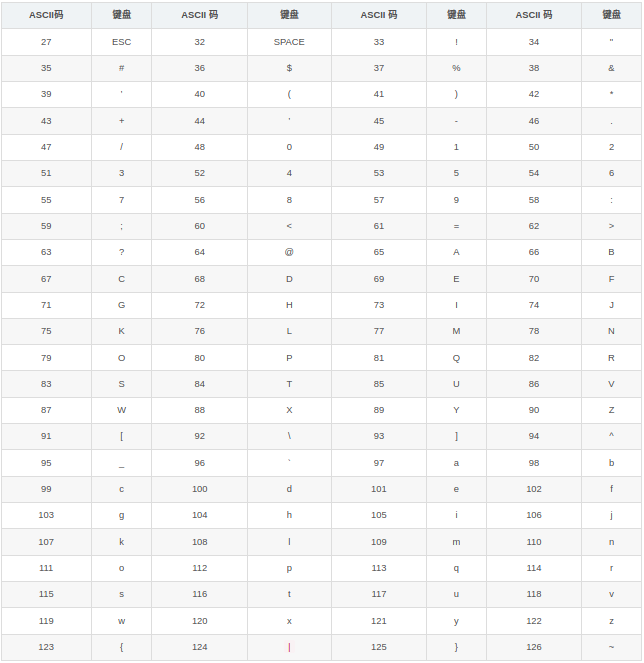

## 常用工具方法总结

### 树节点遍历工具
[TreeUtil.java](https://gitee.com/tomhat/sources/blob/master/java/TreeUtil.md)

### List转 数组
```
/**
 * List转 数组
 * 
 * @param list
 * @return
 */
@SuppressWarnings({ "unchecked" })
public static <T> T[] listToArray(List<T> collection) {
	if (collection == null || collection.size() == 0) {
		return null;
	}
	T[] tArray = ((T[]) Array.newInstance(collection.get(0).getClass(), 0));
	return collection.toArray(tArray);
}
```
### 数组转List
```
/**
 * 数组转List
 * 
 * @param arrays
 * @return
 */
@SuppressWarnings("hiding")
public static <T> List<T> arrayToList(T[] arrays) {
	return Arrays.asList(arrays);
}
```

### List分页
```
/**
 * 循环截取某页列表进行分页
 * @param dataList 分页数据
 * @param pageSize  页面大小
 * @param currentPage   当前页面
 * 例：
    int size = 100;
    int pageSize = dataList.size() % size == 0 ? dataList.size() / size : dataList.size() / size + 1;
    for (int page = 1; page < pageSize + 1; page++) {
	List sublist = subPageList(dataList ,size,page);
    }
 *
 */
public static <T> List<T> subPageList(List<T> dataList, int pageSize,int currentPage) {
    List<T> currentPageList = new ArrayList<>();
    if (dataList != null && dataList.size() > 0) {
        int currIdx = (currentPage > 1 ? (currentPage - 1) * pageSize : 0);
        for (int i = 0; i < pageSize && i < dataList.size() - currIdx; i++) {
        	T data = dataList.get(currIdx + i);
            currentPageList.add(data);
        }
    }
    return currentPageList;
}
```

### 字符串时间转UFDate或UFDateTime
```
/**
 * 
 * @param date
 * @param format
 *            年:yyyy,月：MM,日：dd,时：HH,分：mm,秒：ss
 * @return
 */
public static UFDate stringToUFDate(String date, String pattern) {
	SimpleDateFormat format = new SimpleDateFormat(pattern);
	try {
		Date parse = format.parse(date);
		return new UFDate(parse);
	} catch (ParseException e) {
		e.printStackTrace();
	}
	return null;
}

/**
 * 
 * @param date
 * @param format
 *            年:yyyy,月：MM,日：dd,时：HH,分：mm,秒：ss
 * @return
 */
public static UFDateTime stringToUFDateTime(String date, String pattern) {
	SimpleDateFormat format = new SimpleDateFormat(pattern);
	try {
		Date parse = format.parse(date);
		return new UFDateTime(parse);
	} catch (ParseException e) {
		e.printStackTrace();
	}
	return null;
}
```

### 发送邮件
```
<dependency>
    <groupId>com.sun.mail</groupId>
    <artifactId>javax.mail</artifactId>
    <version>1.6.2</version>
</dependency>
<dependency>
    <groupId>commons-lang</groupId>
    <artifactId>commons-lang</artifactId>
    <version>2.6</version>
</dependency>

/**
 *
 * @param from          发件人地址
 * @param fromNiceName  发件人昵称
 * @param smtpUser      发件人地址
 * @param smtpPass      发件人密码 或 授权码
 * @param smtphost      邮箱SMTP服务器地址
 * @param to            收件人地址，多个以,(逗号)分隔
 * @param subject       邮件标题
 * @param content       邮件内容
 */
public static void sendMail(String from, String fromNiceName, 
							String smtpUser, String smtpPass, String smtphost, 
							String to,
							String subject, String content) {
	if (StringUtils.isEmpty(from)
			|| StringUtils.isEmpty(smtpUser)
			|| StringUtils.isEmpty(smtpPass)
			|| StringUtils.isEmpty(smtphost)
			|| StringUtils.isEmpty(to)
			|| StringUtils.isEmpty(subject)
			|| StringUtils.isEmpty(content)) {
		throw new NullPointerException("必要参数不能为空");
	}
	Properties props = new Properties();
	props.setProperty("mail.host", smtphost);
	props.setProperty("mail.smtp.auth", "true");

	Authenticator authenticator = new Authenticator(){
		@Override
		public PasswordAuthentication getPasswordAuthentication() {
			return new PasswordAuthentication(smtpUser,smtpPass);
		}
	};
	Session session = Session.getDefaultInstance(props, authenticator);
	session.setDebug(true);
	Message message = new MimeMessage(session);

	try {
		if (StringUtils.isEmpty(fromNiceName)) {
			fromNiceName = "亚康万玮";
		}
		message.setFrom(new InternetAddress (from, fromNiceName, "UTF-8"));
		message.setRecipients(MimeMessage.RecipientType.TO,InternetAddress.parse(to));
		message.setRecipients(MimeMessage.RecipientType.CC,InternetAddress.parse(to));  // 抄送
		message.setRecipients(MimeMessage.RecipientType.BCC,InternetAddress.parse(to)); // 密送
		try {
			message.setSubject(MimeUtility.encodeText(subject,MimeUtility.mimeCharset("utf8"), null));
			message.setContent(content,"text/html;charset=UTF-8");
			Transport.send(message);
		} catch (Exception e) {
			e.printStackTrace();
		}
	} catch (AddressException e) {
		e.printStackTrace();
	} catch (MessagingException e) {
		e.printStackTrace();
	} catch (UnsupportedEncodingException e) {
		e.printStackTrace();
	}
}
```

### 生成随机字符串
```
/**
 *
 * @param length  生成字符串长度
 * @return
 */
public static String getRandomString(Integer length) {
	String value = "";
	Random random = new Random();
	if (length == null) {
		length = 6;
	}
	int numbers = length; // 如果想要7-16位: random.nextInt(9) + 7;
	for (int i = 0; i < numbers; i++) {
		// 输出字母还是数字
		String charOrNum = random.nextInt(2) % 2 == 0 ? "char" : "num";
		// 字符串
		if ("char".equalsIgnoreCase(charOrNum)) {
			//取得大写字母还是小写字母
			int choice = random.nextInt(2) % 2 == 0 ? 65 : 97;
			value += (char) (choice + random.nextInt(26));
		} else if ("num".equalsIgnoreCase(charOrNum)) {
			// 数字
			value += String.valueOf(random.nextInt(10));
		}
	}
	return  value.toUpperCase();
}
```
