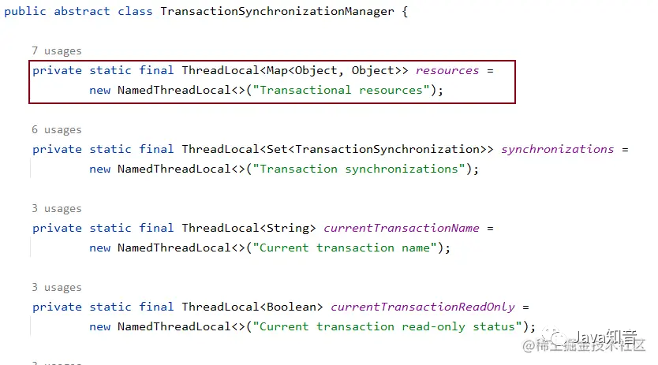

## Spring 事务失效的十种常见场景

### 概述

Spring针对Java Transaction API (JTA)、JDBC、Hibernate和Java Persistence API(JPA)等事务 API，实现了一致的编程模型，而Spring的声明式事务功能更是提供了极其方便的事务配置方式，配合Spring Boot的自动配置，大多数Spring Boot项目只需要在方法上标记@Transactional注解，即可一键开启方法的事务性配置。

但是，事务如果没有被正确出，很有可能会导致事务的失效，带来意想不到的数据不一致问题，随后就是大量的人工接入查看和修复数据，该篇主要分享Spring事务在技术上的正确使用方式，避免因为事务处理不当导致业务逻辑产生大量偶发性BUG。

在分析事务失效的常见场景之前，我们先来了解一下：事务的传播类型 和 @Transactionnal 注解的不同属性的含义。

### 事务的传播类型
```
//如果有事务, 那么加入事务, 没有的话新建一个(默认)
@Transactional(propagation=Propagation.REQUIRED)
//容器不为这个方法开启事务 
@Transactional(propagation=Propagation.NOT_SUPPORTED)
//不管是否存在事务, 都创建一个新的事务, 原来的挂起, 新的执行完毕, 继续执行老的事务 
@Transactional(propagation=Propagation.REQUIRES_NEW) 
//必须在一个已有的事务中执行, 否则抛出异常
@Transactional(propagation=Propagation.MANDATORY) 
//必须在一个没有的事务中执行, 否则抛出异常(与Propagation.MANDATORY相反)
@Transactional(propagation=Propagation.NEVER) 
//如果其他bean调用这个方法, 在其他bean中声明事务, 那就用事务, 如果其他bean没有声明事务, 那就不用事务
@Transactional(propagation=Propagation.SUPPORTS) 
```

### isolation
该属性用于设置底层数据库的事务隔离级别，事务的隔离级别介绍：
```
// 读取未提交数据(会出现脏读, 不可重复读) 基本不使用
@Transactional(isolation = Isolation.READ_UNCOMMITTED)
// 读取已提交数据(会出现不可重复读和幻读) Oracle默认
@Transactional(isolation = Isolation.READ_COMMITTED)
// 可重复读(会出现幻读) MySQL默认
@Transactional(isolation = Isolation.REPEATABLE_READ)
// 串行化
@Transactional(isolation = Isolation.SERIALIZABLE)
```

### @Transactionnal注解属性
@Transactional注解可以作用于接口、接口方法、类以及类方法上，它可以通过不同的参数来选择什么类型Exception异常下执行回滚或者不回滚操作。


## Spring事务失效的场景

### 1. 事务方法未被Spring管理

如果事务方法所在的类没有注册到Spring IOC容器中，也就是说，事务方法所在类并没有被Spring管理，则Spring事务会失效，举个例子
```
/**
 * 商品业务实现层
 *
 * @author: austin
 * @since: 2023/2/10 14:19
 */
public class ProductServiceImpl extends ServiceImpl<ProductMapper, Product> implements IProductService {

    @Autowired
    private ProductMapper productMapper;

    @Override
    @Transactional(propagation = Propagation.REQUIRES_NEW)
    public void updateProductStockById(Integer stockCount, Long productId) {
        productMapper.updateProductStockById(stockCount, productId);
    }
}
```
`ProductServiceImpl`实现类上没有添加`@Service`注解，Product的实例也就没有被加载到Spring IOC容器，此时`updateProductStockById()`方法的事务就会在Spring中失效。

### 2. 方法使用final类型修饰
有时候，某个方法不想被子类重新，这时可以将该方法定义成final的。普通方法这样定义是没问题的，但如果将事务方法定义成final，例如：
```
@Service
public class OrderServiceImpl {

    @Transactional
    public final void cancel(OrderDTO orderDTO) {
        // 取消订单
        cancelOrder(orderDTO);
    }
}
```
`OrderServiceImpl`的cancel取消订单方法被final修饰符修饰，Spring事务底层使用了AOP，也就是通过JDK动态代理或者cglib，帮我们生成了代理类，在代理类中实现的事务功能。但如果某个方法用final修饰了，那么在它的代理类中，就无法重写该方法，从而无法添加事务功能。这种情况事务就会在Spring中失效。

> 💡Tips: 如果某个方法是static的，同样无法通过动态代理将方法声明为事务方法。

### 3. 非public修饰的方法
如果事务方式不是public修饰，此时Spring事务会失效，举个例子
```
/**
 * 商品业务实现层
 *
 * @author: austin
 * @since: 2023/2/10 14:19
 */
@Service
public class ProductServiceImpl extends ServiceImpl<ProductMapper, Product> implements IProductService {

    @Autowired
    private ProductMapper productMapper;

    @Override
    @Transactional(propagation = Propagation.REQUIRES_NEW)
    private void updateProductStockById(Integer stockCount, String productId) {
        productMapper.updateProductStockById(stockCount, productId);
    }
}
```
虽然`ProductServiceImpl`添加了`@Service`注解，同时`updateProductStockById()`方法上添加了`@Transactional(propagation = Propagation.REQUIRES_NEW)`注解，但是由于事务方法`updateProductStockById()`被 private 定义为方法内私有，同样Spring事务会失效。

### 4. 同一个类中的方法相互调用
```
@Service
public class OrderServiceImpl extends ServiceImpl<OrderMapper, Order> implements IOrderService {
    @Autowired
    private OrderMapper orderMapper;
    @Autowired
    private ProductMapper productMapper;

    @Override
    public ResponseEntity submitOrder(Order order) {
        // 保存生成订单信息
        long orderNo = Math.abs(ThreadLocalRandom.current().nextLong(1000));
        order.setOrderNo("ORDER_" + orderNo);
        orderMapper.insert(order);

        // 扣减库存
        this.updateProductStockById(order.getProductId(), 1L);
        return new ResponseEntity(HttpStatus.OK);
    }

    @Transactional(propagation = Propagation.REQUIRES_NEW)
    public void updateProductStockById(Integer num, Long productId) {
        productMapper.updateProductStockById(num, productId);
    }
}
```
`submitOrder()`方法和`updateProductStockById()`方法都在OrderService类中，然而`submitOrder()`方法没有添加事务注解，`updateProductStockById()`方法虽然添加了事务注解，这种情况`updateProductStockById()`会在Spring事务中失效。

### 5. 方法的事务传播类型不支持事务
如果内部方法的事务传播类型为不支持事务的传播类型，则内部方法的事务同样会在Spring中失效，举个例子
```
@Service
public class OrderServiceImpl extends ServiceImpl<OrderMapper, Order> implements IOrderService {
    @Autowired
    private OrderMapper orderMapper;
    @Autowired
    private ProductMapper productMapper;

    @Override
    @Transactional(propagation = Propagation.REQUIRES_NEW)
    public ResponseEntity submitOrder(Order order) {
        long orderNo = Math.abs(ThreadLocalRandom.current().nextLong(1000));
        order.setOrderNo("ORDER_" + orderNo);
        orderMapper.insert(order);

        // 扣减库存
        this.updateProductStockById(order.getProductId(), 1L);
        return new ResponseEntity(HttpStatus.OK);
    }

    /**
     * 扣减库存方法事务类型声明为NOT_SUPPORTED不支持事务的传播
     */
    @Transactional(propagation = Propagation.NOT_SUPPORTED)
    public void updateProductStockById(Integer num, Long productId) {
        productMapper.updateProductStockById(num, productId);
    }
}
```

### 6. 异常被内部catch，程序生吞异常
```
@Service
public class OrderServiceImpl extends ServiceImpl<OrderMapper, Order> implements IOrderService {
    @Autowired
    private OrderMapper orderMapper;
    @Autowired
    private ProductMapper productMapper;

    @Override
    @Transactional(propagation = Propagation.REQUIRES_NEW)
    public ResponseEntity submitOrder(Order order) {
        long orderNo = Math.abs(ThreadLocalRandom.current().nextLong(1000));
        order.setOrderNo("ORDER_" + orderNo);
        orderMapper.insert(order);

        // 扣减库存
        this.updateProductStockById(order.getProductId(), 1L);
        return new ResponseEntity(HttpStatus.OK);
    }

    /**
     * 扣减库存方法事务类型声明为NOT_SUPPORTED不支持事务的传播
     */
    @Transactional(propagation = Propagation.NOT_SUPPORTED)
    public void updateProductStockById(Integer num, Long productId) {
        try {
            productMapper.updateProductStockById(num, productId);
        } catch (Exception e) {
            // 这里仅仅是捕获异常之后的打印（相当于程序吞掉了异常）
            log.error("Error updating product Stock: {}", e);
        }
    }
}
```

### 7. 数据库不支持事务
Spring事务生效的前提是连接的数据库支持事务，如果底层的数据库都不支持事务，则Spring事务肯定会失效的，例如🌰：使用MySQL数据库，选用MyISAM存储引擎，因为MyISAM存储引擎本身不支持事务，因此事务毫无疑问会失效。

### 8. 未配置开启事务
如果项目中没有配置Spring的事务管理器，即使使用了Spring的事务管理功能，Spring的事务也不会生效，例如，如果你是Spring Boot项目，没有在SpringBoot项目中配置如下代码：
```
@Bean
public PlatformTransactionManager transactionManager(DataSource dataSource) {
    return new DataSourceTransactionManager(dataSource);
}
```
如果是以往的Spring MVC项目，如果没有配置下面的代码，Spring事务也不会生效，正常需要在applicationContext.xml文件中，手动配置事务相关参数，比如：
```
<!-- 配置事务管理器 --> 
<bean class="org.springframework.jdbc.datasource.DataSourceTransactionManager" id="transactionManager"> 
    <property name="dataSource" ref="dataSource"></property> 
</bean> 
<tx:advice id="advice" transaction-manager="transactionManager"> 
    <tx:attributes> 
        <tx:method name="*" propagation="REQUIRED"/>
    </tx:attributes> 
</tx:advice> 
<!-- 用切点把事务切进去 --> 
<aop:config> 
    <aop:pointcut expression="execution(* com.universal.ubdk.*.*(..))" id="pointcut"/> 
    <aop:advisor advice-ref="advice" pointcut-ref="pointcut"/> 
</aop:config> 
```

### 9. 错误的传播特性
其实，我们在使用@Transactional注解时，是可以指定propagation参数的。

该参数的作用是指定事务的传播特性，目前Spring支持7种传播特性：

* REQUIRED 如果当前上下文中存在事务，那么加入该事务，如果不存在事务，创建一个事务，这是默认的传播属性值。
* SUPPORTS 如果当前上下文存在事务，则支持事务加入事务，如果不存在事务，则使用非事务的方式执行。
* MANDATORY 如果当前上下文中存在事务，否则抛出异常。
* REQUIRES_NEW 每次都会新建一个事务，并且同时将上下文中的事务挂起，执行当前新建事务完成以后，上下文事务恢复再执行。
* NOT_SUPPORTED 如果当前上下文中存在事务，则挂起当前事务，然后新的方法在没有事务的环境中执行。
* NEVER 如果当前上下文中存在事务，则抛出异常，否则在无事务环境上执行代码。
* NESTED 如果当前上下文中存在事务，则嵌套事务执行，如果不存在事务，则新建事务。

如果我们在手动设置propagation参数的时候，把传播特性设置错了，比如
```
@Service
public class OrderServiceImpl {

    @Transactional(propagation = Propagation.NEVER)
    public void cancelOrder(UserModel userModel) {
        // 取消订单
        cancelOrder(orderDTO);
        // 还原库存
        restoreProductStock(orderDTO.getProductId(), orderDTO.getProductCount());
    }
}
```
我们可以看到`cancelOrder()`方法的事务传播特性定义成了`Propagation.NEVER`，这种类型的传播特性不支持事务，如果有事务则会抛异常。

### 10. 多线程调用
在实际项目开发中，多线程的使用场景还是挺多的。如果Spring事务用在多线程场景中使用不当，也会导致事务无法生效。
```
@Slf4j
@Service
public class OrderServiceImpl {

    @Autowired
    private OrderMapper orderMapper;
    @Autowired
    private MessageService messageService;

    @Transactional
    public void orderCommit(orderModel orderModel) throws Exception {
        orderMapper.insertOrder(orderModel);
        new Thread(() -> {
            messageService.sendSms();
        }).start();
    }
}

@Service
public class MessageService {

    @Transactional
    public void sendSms() {
        // 发送短信
    }
}
```
通过示例，我们可以看到订单提交的事务方法`orderCommit()`中，调用了发送短信的事务方法`sendSms()`，但是发送短信的事务方法`sendSms()`是另起了一个线程调用的。

这样会导致两个方法不在同一个线程中，从而是两个不同的事务。如果是`sendSms()`方法中抛了异常，`orderCommit()`方法也回滚是不可能的。

实际上，Spring的事务是通过ThreadLocal来保证线程安全的，事务和当前线程绑定，多个线程自然会让事务失效。
