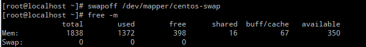
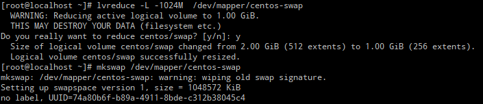
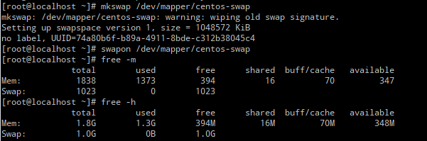

Linux的swap可调大和调小，如果系统内存足够大的化应该让系统避免过多的使用swap，使用系统内存能提高效率

使用fdisk -l 获取swap的磁盘路径 `/dev/mapper/centos-swap`


停用swapimage
```
swapoff /dev/mapper/centos-swap
```
停用之后使用free -m查看swap均为0



设置swap
```
lvreduce -L -1024M  /dev/mapper/centos-swap
```


重新分配swap
```
mkswap /dev/mapper/centos-swap
```

开启swap
```
swapon /dev/mapper/centos-swap
```
