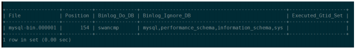
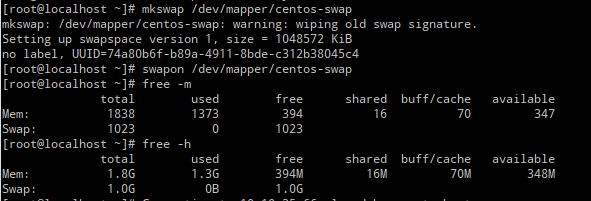

# 搭建主主数据库

## 1. 物理环境及网络规划 

| 序号 | 角色 | 地址 |
| -- | --- | ---|
| 1 | VIP | 172.168.0.10 |
| 2 | 服务器A | 172.168.0.11 |
| 3 | 服务器B | 172.168.0.12 |

## 2. 软件信息

| 序号 | 名称 | 版本 |
| -- | --- | ---|
| 1 | MySQL |  |
| 2 | Keepalived |  |

## 3. 搭建主主数据库

### 3.1 修改Server-UUID
【服务器 A】操作:
替换 server-uuid  
生成 UUID，执行：  
```
[root@swanstack01 mysql]# uuidgen 
fd193e87-0509-4982-8747-c10c4876024b
```
替换/opt/swancmp/mysql/data/auto.cnf 文件中的
```
[root@swanstack01 mysql]# vim /opt/swancmp/mysql/data/auto.cnf
server-uuid=fd193e87-0509-4982-8747-c10c4876024b
```
【服务器 B】操作:
替换 server-uuid
生成 UUID，执行：
```
[root@swanstack01 mysql]# uuidgen 
9ff6a1ca-5d84-11ec-a4f8-005056871892
```
替换/opt/swancmp/mysql/data/auto.cnf 文件中的
```
[root@swanstack01 mysql]# vim /opt/swancmp/mysql/data/auto.cnf
server-uuid=9ff6a1ca-5d84-11ec-a4f8-005056871892
```

### 3.2 配置双主
【A 服务器】操作：
```
[root@swanstack01 mysql]# vim /opt/swancmp/mysql/my.cnf
```
在[mysqld]节下增加：
```
server-id=11                            #此 id 不能重复，一般为本机 IP 末尾数字
auto_increment_offset=1
auto_increment_increment=2
log-bin=mysql-bin
binlog-format=ROW
max_binlog_size=256M
skip-name-resolve
expire_logs_days=7

binlog-do-db=swancmp                    # 数据库
binlog-ignore-db=mysql
binlog-ignore-db=performance_schema
binlog-ignore-db=information_schema
binlog-ignore-db=sys

relay_log=mysql-relay-bin
replicate-do-db=swancmp                 # 数据库
replicate-ignore-db=mysql
replicate-ignore-db=performance_schema
replicate-ignore-db=information_schema
replicate-ignore-db=sys
slave-skip-errors=all

log-slave-updates=ON
```
重启数据库服务 
```
[root@swanstack01 mysql]# cd /opt/swancmp/mysql/
[root@swanstack01 mysql]# ./scripts/ctl.sh restart
```

【B 服务器】操作：
```
[root@swanstack02 mysql]# vim /opt/swancmp/mysql/my.cnf
```
在[mysqld]节下增加：
```
server-id=12                                # 此 id 不能重复，一般为本机 IP 末尾数字
auto_increment_offset=2
auto_increment_increment=2
log-bin=mysql-bin
binlog-format=ROW
max_binlog_size=256M
skip-name-resolve
expire_logs_days=7

binlog-do-db=swancmp                        # 数据库
binlog-ignore-db=mysql
binlog-ignore-db=performance_schema
binlog-ignore-db=information_schema
binlog-ignore-db=sys

relay_log=mysql-relay-bin
replicate-do-db=swancmp                     # 数据库
replicate-ignore-db=mysql
replicate-ignore-db=performance_schema
replicate-ignore-db=information_schema
replicate-ignore-db=sys
slave-skip-errors=all

log-slave-updates=ON
```
重启数据库服务 
```
[root@swanstack01 mysql]# cd /opt/swancmp/mysql/
[root@swanstack01 mysql]# ./scripts/ctl.sh restart
```

### 3.3 创建数据库同步用户
【A 服务器】操作：  
3.3.A.1. 登录数据库
```
[root@swanstack01 mysql]# cd /opt/swancmp/mysql/
[root@swanstack01 mysql]# ./bin/mysql -uroot -pXXXXXX
```
3.3.A.2. 创建远程同步用户
```
Mysql>GRANT REPLICATION SLAVE ON *.* TO 'slave'@'172.16.0.12' IDENTIFIED BY 'SlavePasswd';
mysql> flush privileges;
```

【B 服务器】操作：
3.3.B.1. 登录数据库
```
[root@swanstack02 mysql]# cd /opt/swancmp/mysql/
[root@swanstack02 mysql]# ./bin/mysql -uroot -pXXXXXX
```
3.3.B.2. 创建远程同步用户
```
Mysql>GRANT REPLICATION SLAVE ON *.* TO 'slave'@'172.16.0.11' IDENTIFIED BY 'SlavePasswd';
mysql> flush privileges;
```

### 4. 创建同步服务
#### A→B 同步数据库
【A 服务器】操作：
4.A.1. 登录数据库
```
[root@swanstack01 mysql]# cd /opt/swancmp/mysql/
[root@swanstack01 mysql]# ./bin/mysql -uroot -pXXXXXX
```
4.A.2. 查看 A 服务的日志偏移量
```
Mysql> show master status;
```


需要获得： 
```
Bin-log: my-bin.000001 
Position: 154 
```

【B 服务器】操作：
4.B.1. 登录数据库
```
[root@swanstack01 mysql]# cd /opt/swancmp/mysql/
[root@swanstack01 mysql]# ./bin/mysql -uroot -pXXXXXX
```
4.B.2、 配置同步策略
```
mysql> change master to master_host='172.16.0.11',master_port=3307,master_user='slave',master_password='SlavePasswd',master_log_file='mysqlbin.000001',master_log_pos=154;
mysql> start slave;
mysql> show slave status\G;

```


**需要关注以上两个状态是否为 YES，如果不是需要查看数据库日志进行排错。**

【A 服务器】操作：
13、 登录数据库
```
[root@swanstack01 mysql]# cd /opt/swancmp/mysql/
[root@swanstack01 mysql]# ./bin/mysql -uroot -pXXXXXX
```
14、 解锁数据库表
```
Mysql>use swancmp;
Mysql> UNLOCK TABLES;
Mysql > exit;
```

#### B→A 同步数据库
【B 服务器】操作：
1、登录数据库
[root@swanstack02 mysql]# cd /opt/swancmp/mysql/
[root@swanstack02 mysql]# ./bin/mysql -uroot -pXXXXXX
2、查看 B 服务器的日志偏移量
```
Mysql>show master status;
```


需要获得：
```
Bin-log: my-bin.000001 
Position: 154 
```
【A 服务器】操作：
3、登录 A 数据库
```
[root@swanstack01 mysql]# cd /opt/swancmp/mysql/
[root@swanstack01 mysql]# ./bin/mysql -uroot -pXXXXXX
```
4、配置同步策略
```
mysql> change master to 
master_host='172.16.0.12',master_port=3307,master_user='slave',master_pa
ssword='SlavePasswd',master_log_file='mysqlbin.000001',master_log_pos=154;
mysql> start slave;
mysql> show slave status\G;
```

**需要关注以上两个状态是否为 YES，如果不是需要查看数据库日志进行排错。**

## 部署 VIP
1. 安装软件包
【A 服务器】
```
[root@swanstack01 mysql]# yum install -y keepalived net-tools
[root@swanstack01 ~]# systemctl enable keepalived
[root@swanstack01 ~]# systemctl start keepalived
```
【B 服务器】
```
[root@swanstack02 mysql]# yum install -y keepalived net-tools
[root@swanstack01 ~]# systemctl enable keepalived
[root@swanstack01 ~]# systemctl start keepalived
```
2. 配置服务
1.5.4.2.1 【A 服务器】
编辑文件：vi /etc/keepalived/keepalived.conf 内容如下：
```
[root@swanstack01 ~]# vi /etc/keepalived/keepalived.conf
! Configuration File for keepalived
global_defs {
 notification_email {
 admin@xx.cn #替换为实际的邮箱
 }
 notification_email_from admin@xx.cn #替换为实际的邮箱
 smtp_server 172.16.0.11 #替换为本机的实际地址
 smtp_connect_timeout 30
 router_id swancmp_ha
}
vrrp_script chk_service {
 script "/etc/keepalived/check_service.sh"
 interval 3
 weight 2
}
vrrp_instance VI_1 {
state MASTER
 interface ens192 #替换为实际的网卡
 virtual_router_id 55
 priority 88
 advert_int 1
 authentication {
 auth_type PASS
 auth_pass 1111
 }
 virtual_ipaddress {
 172.16.0.10 #替换为实际的 vip 地址
 }
 track_script {
 chk_service
 }
}

```

3. 配置脚本

> 注意：需要修改此脚本内容：
> sqlport=3307 #数据库服务端口，请根据实际情况修改，默认 3307
> webport=8080 #tomca 服务端口，请根据实际情况修改，默认 8080

将脚本放置于 /etc/keepalived/ 目录下，并赋权 744
```
[root@swanstack01 ~]# chmod 744 /etc/keepalived/check_service.sh
```

【B 服务器】
编辑文件：vi /etc/keepalived/keepalived.conf 内容如下：
```
[root@swanstack02 ~]# vi /etc/keepalived/keepalived.conf
! Configuration File for keepalived
global_defs {
 notification_email {
 admin@xx.cn #替换为实际的邮箱
 }
 notification_email_from admin@xx.cn #替换为实际的邮箱
 smtp_server 172.16.0.12 #替换为实际的本机地址
 smtp_connect_timeout 30
 router_id swancmp_ha
}
vrrp_script chk_service {
 script "/etc/keepalived/check_service.sh"
 interval 3
 weight 2
}
vrrp_instance VI_1 {
state BACKUP
 interface ens192 #替换为实际的网卡
 virtual_router_id 55
 priority 44
 advert_int 1
 authentication {
 auth_type PASS
 auth_pass 1111
 }
 virtual_ipaddress {
 172.16.0.10 #替换为实际的 vip 地址
 }
 track_script {
 chk_service
 }
}
```
配置脚本
> 注意：需要修改此脚本内容：
> sqlport=3307 #数据库服务端口，请根据实际情况修改，默认 3307
> webport=8080 #tomca 服务端口，请根据实际情况修改，默认 8080

将脚本放置于/etc/keepalived/ 目录下，并赋权 744
```
[root@swanstack02 ~]# chmod 744 /etc/keepalived/check_service.sh
```

重新启动服务
【A 服务器】
```
[root@swanstack01 ~]# systemctl restart keepalived
```
【B 服务器】
```
[root@swanstack02 ~]# systemctl restart keepalived
```
1.5.5 启动应用
确认 swancmp Tomcat 服务成功启动，准备测试。

测试访问
http://VIP:8080